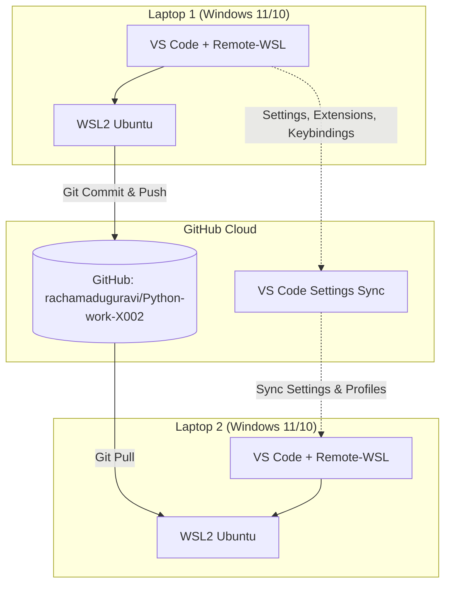

# VS Code Multi-Laptop Sync & Development Workflow via WSL2 and GitHub

## Overview
This implementation plan establishes a synchronized, reproducible, and performant VS Code development environment across **two Windows laptops** using **WSL2 (Ubuntu)** and **GitHub** as the central repository and synchronization hub.

The plan resolves the target URL (`https://share.google/aimode/8nnbQqedTh5esLnCI` &rarr; *"sync two vscode workspace on two laptops windows"*) and integrates with the repository [rachamaduguravi/Python-work-X002](https://github.com/rachamaduguravi/Python-work-X002) and local workspace [Z:\Work\Python-work\X002](file:///z:/Work/Python-work/X002).

---

## User Review Required

> [!IMPORTANT]
> **WSL2 Filesystem Performance vs. Windows Mounts (`/mnt/c` / `Z:` drive)**:
> In Windows WSL2, storing git repositories and Python virtual environments inside the native Linux virtual disk (e.g., `~/projects/` or `/home/$USER/Python-work-X002`) provides **3x–10x faster I/O performance** compared to running directly across `/mnt/c/...` or USB mounts (`Z:\`).
> 
> *Options:*
> 1. **Pure WSL2 Native Filesystem (Recommended)**: Clone the repo in `~/projects/Python-work-X002` inside WSL2 on both laptops, open via VS Code Remote - WSL (`code .`).
> 2. **Mirrored Windows / WSL Mount**: Keep files on `Z:\Work\Python-work\X002` (`/mnt/c/raviWork/USBs/ravi07/Work/Python-work/X002`) and access them from WSL2 or Windows.

> [!NOTE]
> **Authentication Method**:
> You can authenticate with GitHub using either:
> 1. **SSH Key Pair (`ed25519`)** (best for WSL2 terminal & automated pushes without popups).
> 2. **GitHub CLI (`gh auth login`)** or **Git Credential Manager (`GCM`)** configured across Windows and WSL2.

---

## Architecture & Workflow Strategy



---

## Proposed Changes & Setup Plan

### Component 1: Initializing Workspace & GitHub Repository

#### [NEW] [.gitignore](file:///z:/Work/Python-work/X002/.gitignore)
Create a Python & VS Code `.gitignore` file to ensure local environment artifacts (virtual environments, `.env` secrets, `__pycache__`, OS metadata) are never committed or cause sync conflicts:
- `__pycache__/`, `*.py[cod]`, `*$py.class`
- `.venv/`, `env/`, `venv/`, `ENV/`
- `.env`, `.env.local`
- `.vscode/*.log`, `.idea/`, `.DS_Store`, `Thumbs.db`

#### [NEW] [README.md](file:///z:/Work/Python-work/X002/README.md)
Document project purpose, setup scripts, and environment bootstrapping instructions.

#### [NEW] [.vscode/extensions.json](file:///z:/Work/Python-work/X002/.vscode/extensions.json)
List recommended extensions (Python, Pylance, Black Formatter, WSL) so both laptops automatically install identical development tools when opening the workspace.

#### [NEW] [.vscode/settings.json](file:///z:/Work/Python-work/X002/.vscode/settings.json)
Workspace-specific settings (formatting on save, Python default interpreter path `.venv/bin/python`, linting rules).

#### [NEW] [setup_env.sh](file:///z:/Work/Python-work/X002/setup_env.sh)
A quick bootstrap shell script for WSL2 on any laptop to:
1. Check/install Python `venv` and `pip`.
2. Create and activate `.venv`.
3. Install dependencies from `requirements.txt` or `pyproject.toml`.

---

### Component 2: Git & WSL2 Configuration Steps (Both Laptops)

#### Step 1: GitHub Authentication in WSL2 (SSH Setup)
Run inside WSL2 terminal on **Laptop 1** and **Laptop 2**:
```bash
# Generate modern ed25519 SSH key
ssh-keygen -t ed25519 -C "johndoe@example.com" -f ~/.ssh/id_ed25519

# Display public key to copy to GitHub (Settings -> SSH and GPG Keys)
cat ~/.ssh/id_ed25519.pub

# Test connection
ssh -T git@github.com
```

Alternatively, share Git Credential Manager from Windows into WSL2:
```bash
git config --global credential.helper "/mnt/c/Users/rrachama/Documents/Falcon/Tools/GitBash/mingw64/bin/git-credential-manager.exe"
```

#### Step 2: Initialize & Push from Laptop 1 (Current Machine)
```powershell
# In Z:\Work\Python-work\X002
git init
git add .gitignore README.md .vscode setup_env.sh cmdscr.md
git commit -m "feat: initial project structure and WSL2 sync setup"
git branch -M main
git remote add origin git@github.com:rachamaduguravi/Python-work-X002.git
git push -u origin main
```

#### Step 3: Clone & Setup on Laptop 2
Inside WSL2 on Laptop 2:
```bash
# Clone the repository
mkdir -p ~/projects && cd ~/projects
git clone git@github.com:rachamaduguravi/Python-work-X002.git
cd Python-work-X002

# Run bootstrap script
chmod +x setup_env.sh
./setup_env.sh

# Open in VS Code with WSL integration
code .
```

---

### Component 3: VS Code Settings & Extension Synchronization

To sync VS Code configuration (extensions, themes, keybindings, settings) automatically between both laptops:
1. In VS Code on **Laptop 1**: Click the **Gear Icon (bottom-left)** &rarr; **Turn on Settings Sync...**
2. Sign in with your GitHub account (`rachamaduguravi`).
3. Select items to sync: *Settings, Keyboard Shortcuts, Extensions, User Snippets, UI State*.
4. On **Laptop 2**: Open VS Code &rarr; **Turn on Settings Sync...** &rarr; Sign in with the same GitHub account.
5. Extensions installed inside WSL2 will be automatically tracked in the workspace's `.vscode/extensions.json`.

---

## Daily Multi-Laptop Sync Workflow

| Action | Laptop 1 (Before Leaving) | Laptop 2 (When Starting) |
|---|---|---|
| **Save / Sync Code** | `git add .`<br>`git commit -m "WIP: summary"`<br>`git push` | `git pull --rebase` |
| **Branch Switching** | `git checkout -b feature/xyz`<br>`git push -u origin feature/xyz` | `git fetch`<br>`git checkout feature/xyz` |
| **New Dependencies** | Add to `requirements.txt`<br>`pip freeze > requirements.txt`<br>`git commit && git push` | `git pull`<br>`./setup_env.sh` (or `pip install -r requirements.txt`) |

---

## Verification Plan

### Automated / Command Verification
1. **Initialize Git Repo**: Run `git init`, add remote, verify `git remote -v`.
2. **Verify WSL2 Execution**: Execute `setup_env.sh` inside WSL2 environment (`wsl ./setup_env.sh`) to verify clean `.venv` creation.
3. **Commit & Push Test**: Commit boilerplate structure and perform dry-run/push to `rachamaduguravi/Python-work-X002`.

### Manual Verification
1. Test opening the workspace from Windows terminal using `wsl` / `code .`.
2. Verify GitHub repository contains all files without untracked artifacts.
3. Clone to second machine and execute `code .` to ensure remote WSL server connects seamlessly.


---

### Comparison Matrix

| Feature | SSH Key Pair (`ed25519`) | Git Credential Manager (GCM) |
| :--- | :--- | :--- |
| **Authentication Flow** | Cryptographic key pair generated in WSL2 (`~/.ssh/id_ed25519`). | OAuth2 web browser login or Windows credential vault. |
| **Setup Complexity** | **Very simple & self-contained**: `ssh-keygen` & paste public key to GitHub. | Requires configuring WSL2 `gitconfig` to execute Windows `.exe`. |
| **Corporate / Multi-Device Stability** | **High**: Pure Linux stack inside WSL2; immune to Windows path/interop latency. | **Medium**: Relies on WSL2 interop calling Windows `.exe`. Can break if `.wslconfig` disables interop or path translation. |
| **2FA / Passkeys / SSO Support** | Supported via GitHub key dashboard. | Direct OAuth browser popups (convenient for SAML SSO). |
| **Automation / Headless / Cron** | **Flawless**: No GUI or user interaction needed. | Can hang in headless/automated scripts waiting for browser dialogs. |
| **URL Format** | `git@github.com:username/repo.git` | `https://github.com/username/repo.git` |

---

### Which One Should You Choose?

#### 1. Choose **SSH (`ed25519`)** (⭐ **Recommended**) if:
- You work predominantly inside WSL2 terminal or VS Code Remote - WSL.
- You want a setup that never depends on Windows interop execution, path translation warnings (e.g. `wsl: Failed to translate 'Z:\...'`), or credential helper path issues.
- You want fast, uninterrupted `git push` / `git pull` without browser popups.

#### 2. Choose **Git Credential Manager (GCM)** if:
- Your GitHub organization enforces **SAML Single Sign-On (SSO)** or requires browser-based MFA prompts on every new device session.
- You prefer using HTTPS URLs (`https://github.com/...`) for all repositories.

---

### Quick Setup for Recommended Choice (SSH `ed25519`)

Run inside WSL2:
```bash
# 1. Generate SSH key
ssh-keygen -t ed25519 -C "your_email@example.com" -f ~/.ssh/id_ed25519 -N ""

# 2. Print public key
cat ~/.ssh/id_ed25519.pub
```
1. Copy the output line.
2. Go to **GitHub &rarr; Settings &rarr; SSH and GPG keys &rarr; New SSH key**.
3. Set Title (e.g., `Laptop1-WSL2`) and paste the key.
4. Verify with:
```bash
ssh -T git@github.com
# Response: Hi <username>! You've successfully authenticated...
```

